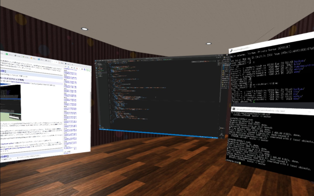
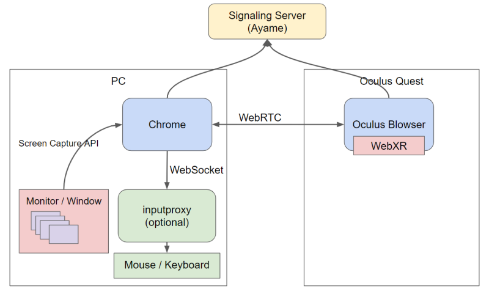

# WebRTC + WebXR Remote Desktop

This is a remote desktop that runs on a browser using WebRTC.



Works with recent versions of Chrome and Edge. In addition to the normal Web UI, you can use WebXR to display your desktop in VR/AR space.
There is also an app version that resides in the task tray.

Demo URL:
- https://tihung99123.github.io/webrtc-rdp/ (Web)
- https://tihung99123.github.io/web-vr-workspace/#app:app-webrtc-rdp (WebXR)


## Usage

It works with a variety of configurations, but the most practical is to install the Electron App version on the host PC and access the desktop from a browser.

1. Access https://tihung99123.github.io/webrtc-rdp/ in your browser or launch the app below.
2. Host/Guest: Generate a PIN in one browser and enter the PIN in the other browser (first time only)
3. Host side: Select the stream you want to share using the "Share Desktop" or "Share Camera" button (browser version only)
4. Guest side: Click the "Open Remote Desktop" link to connect to the other party's desktop. If there are multiple streams, a selection screen will be displayed

- [WebXR](https://tihung99123.github.io/vr-workspace/#app:app-webrtc-rdp) You can connect to your PC desktop in VR mode from the link (for Oculus Quest)
- This is a minimal implementation, so if you want to use it in earnest, please tinker with it.

| Features | Web | WebXR | Electron App |
|------------|-------------|-------|--------------|
| Screen | send/recv | recv | send/recv |
| Mouse/Kbd | send/(recv) | send | send/recv |
| File | send/(recv) | recv | send |

### Mouse/Keyboard

If you want to operate the mouse and keyboard, please use the Electron App version below.

If you really want to move the mouse via the browser, you can do so by starting https://github.com/binzume/inputproxy on the host PC and entering the displayed URL into the form.

### Share files

Drag and drop files and directories onto the host screen to share them.

- When you connect to the desktop with the WebXR version client, it will be added to `Storage`
- Non-VR web UI is available in a separate repository https://github.com/binzume/webrtcfs-web

## Electron App

This is an application that runs on its own even if Chrome is not running. You can also use a mouse and keyboard.

You can download the installer for Windows from the [Releases](https://github.com/binzume/webrtc-rdp/releases/latest) page.

If you want to use it without installing it or for development, start it as follows.

````
git clone https://github.com/binzume/webrtc-rdp.git
cd webrtc-rdp/app
npm install
npx electron-rebuild
npm start
````

An environment that allows you to build Node.js native modules is required.
You can build the executable file with `npm run build-win`.
It has been implemented to work on MacOS and Linux, but operation has only been confirmed on Windows.

# Design



## WebRTC

- WebRTC Signaling Server uses [OpenAyame/ayame](https://github.com/OpenAyame/ayame)
- In the demo implementation, connect to [Ayame Labo](https://ayame-labo.shiguredo.jp/). For full-scale use, it is better to run Ayame yourself.

## VR

- I am using [A-Frame](https://aframe.io/).
- It can be used as [single](https://tihung99123.github.io/webrtc-rdp/webxr/), but in [binzume/vr-workspace](https://github.com/binzume/vr-workspace) It is designed to be loaded as an app.
- VR mode has been confirmed to work with Oculus Browser on Oculus Quest 2.

Oculus Touch controller button assignments:

- Trigger: Left click
- A button: middle click
- B button: Right click
- Grip & Drag: Separate and display windows on the desktop (only when the host is Electron App)

## Security

- Since it is P2P, shared video and audio will not go through the Internet when used within the same network.
- In the demo implementation, we will connect using Ayame Labo. If you need a secure connection, please start and use Ayame in your own environment.
- If you are using Ayame Labo for connection, please do not leave the connection in a waiting state as there is a possibility that someone else will be able to connect if the RoomId is leaked for some reason.
- RoomId is generated from a random string and shared when exchanging PIN.
- Sending and receiving files is a little more secure as it is authenticated using the token shared when confirming the PIN and the DTLS fingerprint at the time of connection (just for comfort)

## TODO

- Clipboard sharing feature
- Make the UI easier to understand

## License

M.I.T.